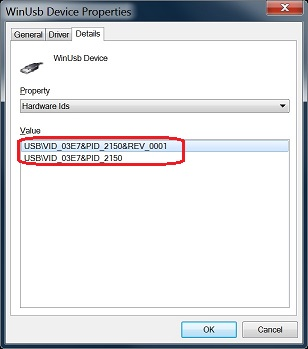

# movidius_windows
How to use the Movidius Neural Compute Stick on Windows

Yes, it is possible to use the Movidius Neural Compute Stick (https://developer.movidius.com/) on windows.
The standard SDK for it is for Ubuntu or Raspian but with a little fiddling you can get it to work, here's how.

## Step 1:
The first step is to download one of the standard windows apps I have already compiled. I recommend starting with the Alexnet app.
That app will allow you to configure and test your stick and make sure the right drivers are installed. 

First plug your stick into a USB port on your computer, it will go through an install, if that worked right you should 
see this when you go to computer->manage->device manager 

Right click on the Winusb device and display properties, the hardware ID;s should be these 

If all that worked OK, then download the test Alexnet app 

