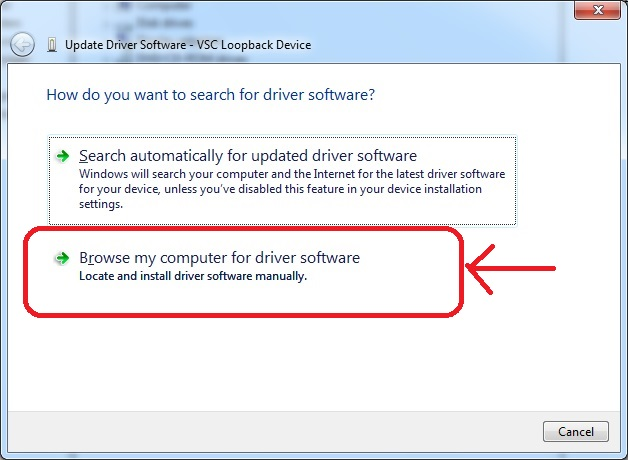
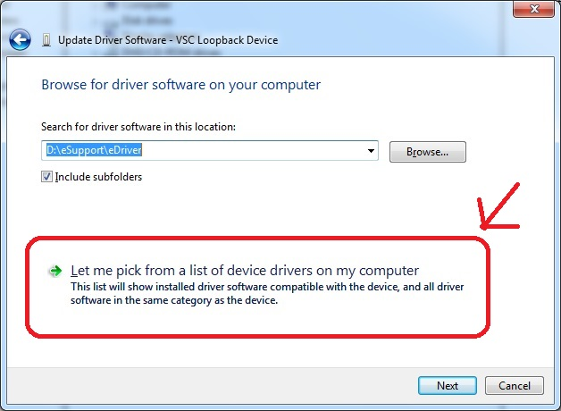

# movidius_windows
How to use the Movidius Neural Compute Stick on Windows

Yes, it is possible to use the Movidius Neural Compute Stick (https://developer.movidius.com/) on windows.
The standard SDK for it is for Ubuntu or Raspian but with a little fiddling you can get it to work, here's how.

## Step 1:
The first step is to download one of the standard windows apps I have already compiled. I recommend starting with the Alexnet app.
That app will allow you to configure and test your stick and make sure the right drivers are installed. 

First plug your stick into a USB port on your computer, it will go through an install, if that worked right you should 
see this 
 

and when you go to computer->manage->device manager you should see an item in there like this 

Right click on the Winusb device and display properties, the hardware ID;s should be these 

If all that worked OK, then download the test alexnet0 test app, that app uses a pre-compiled graph file
which contains the "smarts" of the app. You can compile graph files yourself if you go to the caffe sub-folder of this git.

## Step 2:
Now that you have the Movidius device discovered by Windows, a word about how this little puppy works. It is really two USB devices
The first device is the boot device, the sole purpose of which is to upload the firmware (MvNCAPI.mvcmd) up into the Myriad2
(https://www.movidius.com/myriad2) chip inside of it. The Myriad2 is the real brains of the thing. So when you first plug
in the device the thing shown above (VID=03E7 PID=2150) that is the booter upper. To get it to become a neural net computer,
you have to upload that firmware file. To do that, fire up the alexnet0.exe program and go to the "Output" tab and click Open.

When you click open whilst the Movidius is plugged in, it will upload that firmware (MvNCAPI.mvcmd) file into the Myriad2 chip,
when it does that, it stops being the booter upper (VID=03E7 PID=2150) and turns into a new USB device, as if you unplugged the
booter upper and plugged in a new thing, you will here that "doo dink" sound that Windows makes when you plug and unplug 
a USB device.  You may wonder, why didn't they just make a compound USB device?  Beats the heck out of me, ask the Movidius guys,
I am sure there is a good explanation, probably has something to do with Linux or something.

But anyhow, when you run the alexnet0.exe and click on open the first time the Movidius is plugged in you will get this error,
but don't panic, we only have to go through this rig-a-ma-roll the first time you plug the Movidius into your computer.

and you will also notice that now Windows thinks you plugged in a new device, no big deal, we will let Windows do it's thing
here for a minute. When it's done gyrating you will get this error message. 

That's OK, we are going to fix it now. Go to good old computer->manage->device manager and you should see this 
device in there: 

Notice the devices labeled "VSC Loopback Device", that is what Windows thinks it is right now, don't ask me why.
now just right click on that thing and pick "Update Device Driver" and you should get this dialog box:

Pick the SECOND Option labeled "Browse my computer for driver software and you will get this:

again pick the second option that says "Let me pick from a list of device drivers on my computer".

Now you will see this: 

Picke the Universal Serial Bus devices option. Now you will get this screen: 

on my computer there was just the one choice, if you have others, ignore those and pick "WinUSB Device" from
the list and click next. You will get a warning message: 
 

just click Yes (but don't blame me if disaster strikes, proceed at your own risk !).

It will re-install the device using this new driver and if all goes well you get this: 
 

To double check that all this crap worked right, go back to alexnet0.exe and try open again. If it worked right,
you should get this: 
 

You may need to unplug the Movidius stick and close the alexnet0.exe and plug Movidius back in and start the program again.
If that does not work you may need a reboot.

Assuming things worked and you got the "NCS Device opened normally."  message in alexnet0.exe program, then you can
double check this new device and go to ye ole computer->manage->device manager and look for this, select the 
WinUsb Device, right click and pick properties and now you can check the Hardware ID's and see that they changed:

You can see now the new ID's are (VID=03E7 PID=F63B) a different device, this is the Myriad2 device.
If you click close it will close that one and the booter upper one will come back.

As another check, whilst the Movidius os Open, you can click on "status" button and you should see this:

which just means it is waiting for the graph file to be uploaded.

WHEWY!, that was hard work, but if all that went well, you now should have a Movidius Stick working on your PC.
From now on, you don't have to go through that junk. From now on, you should be able to just plug the Movidius
into your PC and open the alexnet0.exe or other Windows apps from this git and it should work straight away
without all the fiddling.

## Step 3:
Now that we got through all that install hassle, we can actually start having some fun. Assuming everything went OK
so far you should see this on your alexnet0.exe program:

The next step is to load the graph file into the Movidius, if you downloaded the alexnet0/release from this git
there should be a file called "graph" is the same folder as alexnet0.exe (it's a big file about 119MB).
Now click on the button "load graph" and you show see this:

Now we are ready to recognize stuff. Flip over to the tab labeled "Image" and you will see this screen:

If you click on the button labeled "run" at the top bar or in the tab area then the result shold be:

Yeah, the Movidius got the answer right !!! yippee.  For this test program you can load different pictures in
by either clicking on the "load new image" button (it only can load BMP's right now) or you can copy any picture
into the clipboard and past it in.  the picture on the left will show the original picutre shrunk down and then
the picture on the right is that picture re-sampled down. For this demo it will only be able to use 227 x 227 
pixel resolution so it will re-size everything to that.

You will see another tab labeled "Classification" that is a table of all the categories it can recognize
and will show you the probabillity on each. 

If you click on the heading "Probability" it will sort by probability lowest to highest, if you click it 
again it will sort highest to lowest. 

Now just for fun, let's pick a picture off of Google Images just to see how Movidius does.

